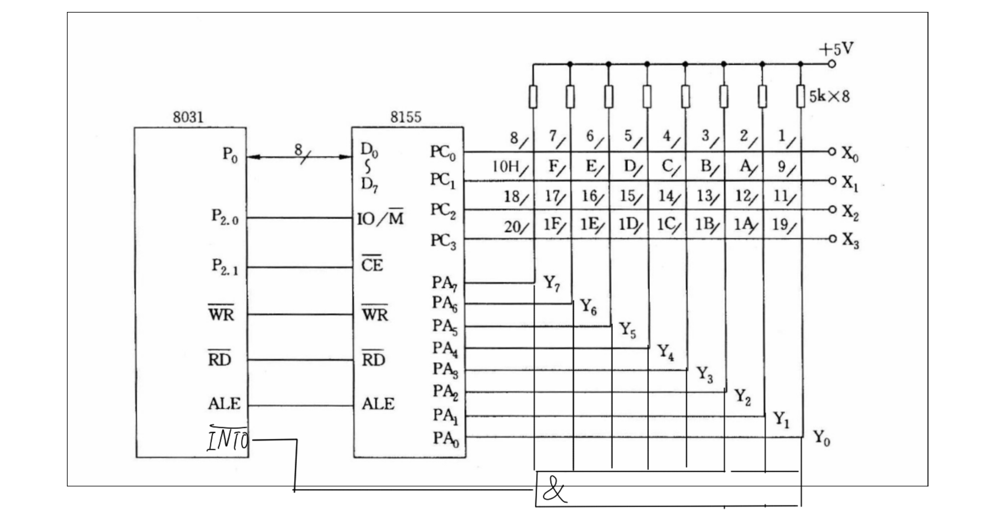
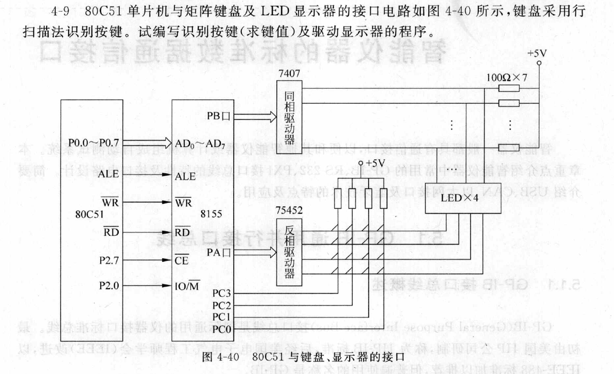

# 第一题
<font size=5>题目:  设计一个4行8列的键盘矩阵，叙述反转法进行键盘采集的流程，叙述特征码识别方法，编写程序
||
|:--:|
|<font size=3>*circuit design*|

## 采集流程
<font size=4>程序默认使用pa口输出低电平，当按键按下时通过与门激活外部中断1,这个时候pc口读取电平信息，随后
改变8155的commda register 让pc输出低电平，pa读取电平。最后通过pa pc的行列信息通过遍历数组keymap查找按键

## 代码
<font size=3>

```c
// for sdcc compiler
#include <8051.h>
#define None 0xFF

typedef unsigned char byte;
typedef unsigned int uint;

__xdata unsigned char __at (0x7F00) internal_command;
__xdata unsigned char __at(0x7F03) pc_4; //address of PC
__xdata unsigned int __at(0x7F01) pa_8; //address of PA

unsigned char find_key_feature(byte row_key,byte num_keys);
unsigned char key_map[] = {0xE7F, 0xEBF, 0xEDF, 0xEEF, 0xEF7, 0xEFB, 0xEFD, 0xEFE,
                           0xD7F, 0xDBF, 0xDDF, 0xDEF, 0xDF7, 0xDFB, 0xDFD, 0xDFE,
                           0xB7F, 0xBBF, 0xBDF, 0xBDF, 0xBF7, 0xBFB, 0xBFD, 0xBFE,
                           0x77F, 0x7BF, 0x7DF, 0x7EF, 0x7F7, 0x7FB, 0x7FD, 0x7FE};
unsigned char key_feature = None;
void delay10ms() {
    uint i, j;
    for (i = 0; i < 100; i++) {
        for (j = 0; j < 1000; j++) {
            ;
        }
    }
}

void main() {
    
    // *****************************
    // command register
    // tim2 tm1 IEB IEA PC2 PC1 PB PA 
    //  7   6   5   4   3   2   1   0
    //                         0 input 1 output
    // *****************************
    EA = 1; // enable interrupt
    IT0 = 1; // interrupt on falling edge
    EX0 = 1; // enable INT0

    internal_command = 0x01; // write to command register A output C input
    pa_8 = 0x00; //  let the output of A to be low
}

byte find_key_feature(byte row_key,byte num_keys) {
   for (byte i=0; i<num_keys; i++) {
      if (row_key == key_map[i]) {
         return i;
      }
   }
   if (num_keys == num_keys) {
      return None; // no key found
   }
}
void ext_int0() __interrupt(0) {
    // 4 row and 8 columns
    byte row_key = pc_4 & 0x0F;
    internal_command = 0x0C;// A input C output
    pc_4 = 0x00; // let the output of PC to be low
    delay10ms(); // delay for 10ms
    byte colum_key = pa_8 & 0xFF;
    uint total_key = (row_key << 8) | colum_key;
    key_feature = find_key_feature(row_key, 32);
    internal_command = 0x01; // write to command register A output C input
    pa_8 = 0x00; //  let the output of A to be low
    delay10ms(); // delay for 10ms
}
```
# 第二题
<font size=5>题目:  

## 采集流程
<font size=4>pa口输出信号，pb、pc口接受信号,用pb、pc计算key值后查表计算其特征码
## 代码
<font size=3>

```c
// for sdcc compiler
#include <8051.h>
#define None 0xFF

typedef unsigned char byte;
typedef unsigned int uint;

__xdata unsigned char __at (0x7F00) internal_command;
__xdata unsigned char __at(0x7F03) pc_4bit; //address of PC
__xdata unsigned int __at(0x7F01) pa_8bit; //address of PA
__xdata unsigned int __at(0x7F02) pb_8bit; //address of PB

unsigned char find_key_feature(byte row_key,byte num_keys);
unsigned char key_map[] = {0xE7F, 0xEBF, 0xEDF, 0xEEF, 0xEF7, 0xEFB, 0xEFD, 0xEFE,
                           0xD7F, 0xDBF, 0xDDF, 0xDEF, 0xDF7, 0xDFB, 0xDFD, 0xDFE,
                           0xB7F, 0xBBF, 0xBDF, 0xBDF, 0xBF7, 0xBFB, 0xBFD, 0xBFE,
                           0x77F, 0x7BF, 0x7DF, 0x7EF, 0x7F7, 0x7FB, 0x7FD, 0x7FE};
unsigned char key_feature = None;
void delay10ms() {
    uint i, j;
    for (i = 0; i < 100; i++) {
        for (j = 0; j < 1000; j++) {
            ;
        }
    }
}
byte find_key_feature(byte row_key,byte num_keys) {
   for (byte i=0; i<num_keys; i++) {
      if (row_key == key_map[i]) {
         return i;
      }
   }
   if (num_keys == num_keys) {
      return None; // no key found
   }
}
void main() {
    
    // *****************************
    // command register
    // tim2 tm1 IEB IEA PC2 PC1 PB PA 
    //  7   6   5   4   3   2   1   0
    //                         0 input 1 output
    // *****************************
    EA = 1; // enable interrupt
    IT0 = 1; // interrupt on falling edge
    EX0 = 1; // enable INT0

    internal_command = 0x01; // write to command register A output C input B input
    pa_8bit = 0x00; //  let the output of A to be low
    while (1)
    {
        byte row_key = pc_4bit & 0x0F;
        byte colum_key = pa_8bit & 0xFF;
        uint key = (row_key << 8) | colum_key;        
        key_feature = find_key_feature(~key, 32);
    }
    
}
```
